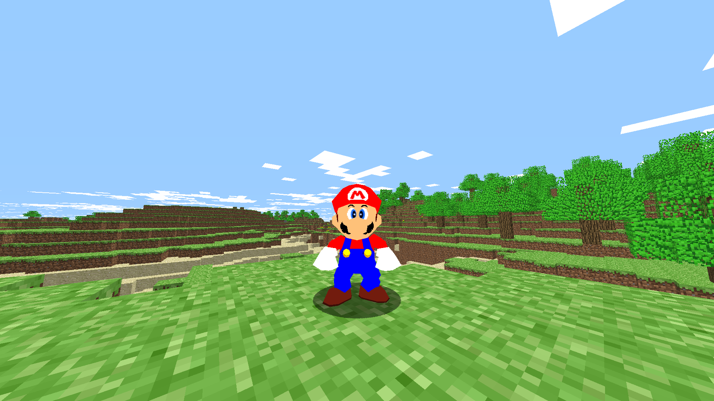

# Classic64
A plugin for [ClassiCube](https://classicube.net) which uses libsm64 to insert a playable Mario from Super Mario 64 into the game.

This is still a work in progress!

[libsm64 audio fork by ckosmic](https://github.com/ckosmic/libsm64/tree/audio) 
This project was not created by, or is related with the developers of the Minecraft mod "Retro64". 
[ClassiCube](https://github.com/UnknownShadow200/ClassiCube) is a custom Minecraft Classic client written in C.

## Compiling the plugin
Download the [MSYS2](https://msys2.org/#installation) development environment, launch MSYS2 MinGW x64 and install gcc, g++ and make.
Finally, run `make`.

A folder named "dist" will be created and inside will sit the plugin dll file "Classic64.dll".
Copy this to your ClassiCube plugins folder.

## Running the plugin
**You are required to supply a dumped copy of your Super Mario 64 US ROM, placed inside the plugins folder, with the filename "sm64.us.z64".
Otherwise the plugin will refuse to work.**

At the moment this only works on 64-bit Windows due to certain quirks with libsm64.
The [original libsm64](https://github.com/libsm64/libsm64) (and [dylanpdx's fork](https://github.com/dylanpdx/libsm64)) only works on 64-bit systems, including Linux (haven't tested macOS but it should be the same result).

However, ckosmic's audio fork only works on 64-bit Windows.

Until a solution comes up for both of these issues, this plugin can only be used on 64-bit Windows systems. If you're on macOS/Linux, use Wine for the time being.

## How to play
To turn into Mario, run the command `/model mario64`. This will let everyone on the server using this plugin know that you're playing as Mario, and will display the model on their end.

If you are on a server with hacks enabled (flying, speed, etc) but the "/model" command is not allowed, you can run the client-side command `/client mario64 force`, at the cost that nobody will see your Mario model.

## Known issues
* Movement on first person camera is buggy/broken.
* Sometimes, if your selected slot on the hotbar is empty (no block on hand, when your hand is visible), while playing as Mario in first person camera, the game might crash.
* Resizing, maximizing or going fullscreen on Direct3D9 builds of ClassiCube with this plugin will crash the game. "Error recreating D3D9 context"
* When switching from the Mario model back to the default model, chances are the game will crash. Happens on Direct3D9 and OpenGL builds.
* If the game crashes when starting:
  * Make sure the ROM matches the SHA-1 checksum: `9bef1128717f958171a4afac3ed78ee2bb4e86ce`

## Client-side commands
All client-side commands start with `/client mario64`

* `/client mario64 music <ID 0-33>` 
Plays music from Super Mario 64. 
To stop music, use music ID 0.

* `/client mario64 cap <option>` 
Change Mario's cap. 
You can choose one of these options: off, on, wing, metal

* `/client mario64 kill` 
Kills Mario instantly.

* `/client mario64 force` 
Force-switch between Mario and the default model. 
Useful if the /model command is disallowed but hacks are enabled.

* `/client mario64 settings <option> [value]` 
Change plugin settings. 
To show all settings, use `/client mario64 settings` 
To show information about a setting (what it does, current value, etc), leave out the value argument: `/client mario64 settings <option>` 
Settings are saved to a file named "Classic64.cfg" in your ClassiCube folder.
